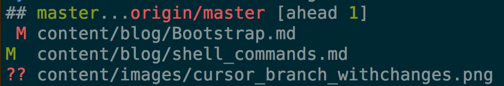

# Unknowing me

Even as only occasional shell user I know about paging up through te command history and using grep for filtering. Committing to shell live and working with experienced developers a few but very useful things popped up, which I never really though about or would have guessed existed. 

#Tips

### Complete commands

!! wil be replaced with last full command,eg:

    $apt-get update
    $sudo !!
    > sudo apt-get update

!$ wil be replaced with last command argument

    $touch some/subpath/newfile.md
    $vim !$
    
{,} expand with change
    
    $cp app/model/{my,new}model.rb
    >cp app/model/mymodel.rb app/model/newmodel.rb 
    
With all these command it will be expanded on tab or expanded and executed on enter.

### Custom prompt

In the shell anything and everything seems tweak-able. From tab names to cursor line. Since I started using the shell and trying to accomplish most tasks there to keep flow, I especially like my git prompt. When ever I'm in a git archive my cursor changes to:

Telling the folder is in sync with the remote

Telling there are local changes

Telling that there are local commits that are not pushed.

* The grey time is an indication of the time past since last commit.
* The green and orange gives the state and which branch is checked out
* The arrow can be up for local commits not pushed, down for upstream changes or both. 

BTW this cursor I copied from [Iain] 

### Aliases, Aliases and ......Aliases

##### Simplify repeated tasks
When starting the to work with the shell and especially starting from scratch coping thing from others, editing the config is a often executed task

    # working with these dotfiles made easier
    alias reload='source ~/.bashrc'
    alias ea='vim ~/.bashrc && reload'
 
With this it is a matter of $ea, change the config, save, quit and de config is automatically loaded.

##### Beautify output
    alias glog='git log --pretty=format:"%C(yellow)%h%C(reset) %C(green)%ar%C(reset) %C(bold blue)%an%C(reset) %C(red)%d%C(reset) %s" --graph --abbrev-commit --decorate'

I copied and configured a bunch of git shortcuts. The above sample gives a nice readout of current state with just a short command like $glog.

First modified, second modified and staged, last untracked files. Not shown: D for deleted and N for new files. 

### Orientation

As a GUI user I sometimes wonder where I'm at. Lucky for me their are some helpful commands.

##### Location

What is the full path to current location: 
    $pdw
    >/Users/stefanvr/Projects/MyPersonalSite

##### Landscape    
What the tree structure at a give location:

    $tree  
    content  
    |-- blog  
    |   |-- Bootstrap.md  
    |   |-- markdown.md  
    |   |-- philosophy_for_my_site.md  
    |   `-- shell_commands.md  
    |-- feed.xml  
    |-- images
    |   |-- avatar.jpg
    |   |-- git_status.png
    |   |-- prompt_branch_withchanges.png
    |   |-- prompt_master_ahead.png
    |   |-- prompt_master_insync.png
    |   |-- searchandfind.PNG
    |   `-- wip.png
    |-- index.html
    |-- script.coffee
    `-- styles.scss
    
 ##### Info
 What is the current mapping for a command:
     
     $which gcm
     >gcm: aliased to git commit -m

#Take away

As with everything, getting really into a thing, with preferable experts nearby, I am really starting to appreciate the strengths and weaknesses of a tool, environment or flow.

[Iain]: https://github.com/iain/dotfiles/blob/master/script/prompt
